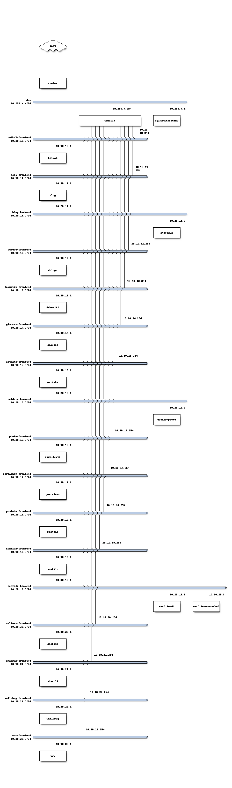

# Hosting

My server installation recipes  (Inspired from https://github.com/tomMoulard/make-my-server)

Bash function to override docker-compose command and manage multiple docker-compose.yml files (non executable YAML files are ignored).

```bash
export DOCKER_COMPOSE_BIN='/usr/bin/docker compose'
docker-compose ()
{
    $DOCKER_COMPOSE_BIN $(find -name 'docker-compose*.yml' -type f -perm -u+x -printf '%p\t%d\n'  2>/dev/null | sort -n -k2 | cut -f 1 | awk '{print "-f "$0}') $@
}
```  

### Network diagram:


